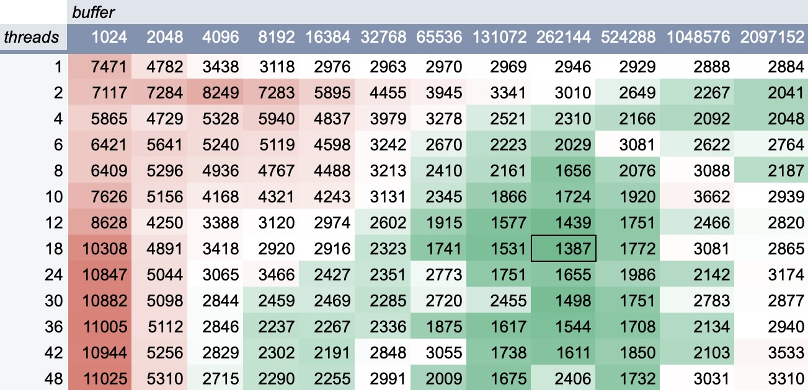

# The One Billion Row Challenge

This is a for-fun project.
I was intrigued by [The One Billion Row Challenge](https://github.com/gunnarmorling/1brc) and wanted to try it out using
Kotlin.

The main idea of the challenge is the following:

1. There is a ~13 GB file with temperature measurements from different cities. For example: `Zanzibar City;-20.5`
2. You need to process the file and calculate min, max, and average temperatures for each city.
3. Experiment the way you want to make the processing as fast as possible.

## How to run it

1. install java 21
2. generate the measurements
   file: [instructions](https://github.com/gunnarmorling/1brc?tab=readme-ov-file#running-the-challenge)
3. select the attempt in Main.kt file (by uncommenting it)
4. run `./run.sh "/path/to/measurements.txt"`

## My results

Environment:

1. MacBook Pro 16, M3 Pro (6P+6E), 36GB, 512GB
2. MacOS 14.6.1
3. JDK: 21.0.4-graal

### Attempt 1

I started with a straightforward single-thread implementation with no optimizations.
It reads the file using `file.useLines`, then splits strings by delimiter `;` and converts the temperature using
`String.toFloat()`

It stores the results in 4 maps:

```kotlin
val maxByCity: HashMap<String, Float>
val minByCity: HashMap<String, Float>
val countByCity: HashMap<String, Int>
val sumByCity: HashMap<String, Double>
```

It takes approximately 230 seconds to finish.

### Attempt 2

For the second attempt, I came up with simple optimizations:

1. Do not create an instance of String for the part of the line containing temperature (save time on String instance
   creation / GC)
2. Since all temperatures are very restricted (always one decimal point, limited from -100 to 100)
   we can use Integers instead of Float for temperature storage and processing.

For example, to parse the temperature I use this:

```kotlin
var temp = 0
var tempMultiplier = 1
for (...) {
    if (char == '-') {
        tempMultiplier = -1 // flipping the temperature
    } else {
        if (char != '.') { // skipping "."
            temp = (temp * 10) + (char.code - 48) // parsing the number digit by digit
        }
    }
}
temp *= tempMultiplier
```

And to print the result I use `temp / 10f`

It takes approximately 158 seconds to finish.

### Attempt 3

For the third attempt, I wanted to add multi-threading and also play with Kotlin coroutines and channels.

It uses 1 coroutine to parse the file and send chunks of rows to a channel:

```kotlin
async {
    file.useLines { lines ->
        lines.chunked(1000).forEach { chunk ->
            linesChannel.send(chunk)
        }
        linesChannel.close()
    }
}.start()
```

There are 12 coroutines which are subscribed to the channel and processing the chunks of rows:

```kotlin
async {
    var lines = linesChannel.receiveCatching().getOrNull()
    val storage = StorageWithStringIntMaps()
    while (lines != null) {
        processLines(lines.iterator(), storage)
        lines = linesChannel.receiveCatching().getOrNull()
    }
    storage
}
```

And in the end, we are summarizing the results from these 12 coroutines:
`deferred.map { it.await() }.reduce { acc, storageWithInt -> acc + storageWithInt }`

It takes approximately 43 seconds to finish which is 3.6 times faster than single-thread implementation.

### Attempt 4 (the most successful)

It was strange that the parallel implementation of Attempt 2 is just 3.6 times faster than the sequential (since I have
6
performance cores).
It turned out that the reason was `File.useLines` which makes too many things on one thread:

1. it reads the file
2. it parses bytes to strings
3. it splits strings by `\n`

I started checking different ways to read files in Java.

1. First, I wanted to map the whole file to memory (using stable API). But this operation failed since the file is too
   big for that.
2. Then I decided to use `FileChannel.open(path, StandardOpenOption.READ)` since it allows to move the cursor freely (
   needed for parallel read operations) and works pretty fast.

I checked different combinations of the number of threads and ByteBuffer size.

During these tests, I was counting the number of read bytes to not overload the machine.
According to the results, the fastest way to read the file is to use 18-24 threads. And 128-256KB buffer size. And the
read
takes just 1.4-1.5 seconds.
Later, after tests on the final version of the code I stopped on 24 threads and 256KB buffer size.

The number of threads is not random. These threads are balancing between performance and efficiency cores like this:

* 18 threads for 6 performance cores
* 6 threads for 6 efficiency cores

Now, we can read the file fast, but we need to figure out how to process random parts of the file.
Previously, Kotlin split the file into lines for me, but now I need to do it myself.
And the worst part - nobody guarantees that the chunk of the file some thread is working with start from the beginning
of the city's name and ends with a line separator.

So, every thread, in addition to its results, returns chopped parts of the file to join and process them later.

Every thread processes its chunk byte by byte in the following manner:

1. find the line separator
2. process the found line byte by byte:
    1. find separator
    2. extract the city name (to the left from the separator) and temperature (to the right from the separator)
    3. add the results to thread local storage

In addition to these changes, I updated the storage class to utilize only 1 HashMap, which reduced time spent on hashes
and equals checks, etc.

The resulting code takes 5.251 seconds (best result) to finish, which is 8 times faster than the previous result and 44
times faster than the first attempt.

### Attempt 5

I thought that it might be worth it to move the ByteArray to String conversion to the final part, so we won't need to
make such a conversion for a billion rows.
So I started using ByteArray as a key in the Storage map, and to do it I created a wrapper for ByteArray (otherwise
equals and hashCode methods won't work as expected in map).

But the resulting time (5.325 seconds) was worse than the previous attempt.

### Attempt 6

As the final step, I decided to make a custom HashMap which won't require a wrapper for a ByteArray.
I even experimented with custom hash functions for ByteArray, but I never got results better than in Attempt 4.
The best result was 5.678 seconds.

So it looks like custom methods for ByteArray hashing and equals checks can't be faster than the embedded JDK methods.

### Comparison with the best-known Java code for the challenge

According to the 1brc repo, the best Java implementation is this
one: [link](https://github.com/gunnarmorling/1brc/blob/main/src/main/java/dev/morling/onebrc/CalculateAverage_thomaswue.java).
It utilizes many tricks I never even thought of. For example:

1. It uses a "preview" (experimental) API to map the whole file to memory. It stays in memory if you restart the
   calculation for 2nd time in a row.
2. It works with memory directly and reads and processes memory chunks as long values. To process these long values it
   heavily utilizes bit operations.

The first execution of this code usually takes 6-11 seconds to finish.
The second execution takes 2-3 seconds to finish
Next executions take about 1.15 - 1.2 seconds to finish.

I think it is a bit unfair that it caches the file in memory.
So if we exclude that - it turns out that my implementation is 0.8 seconds faster :)

